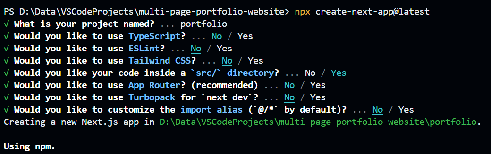
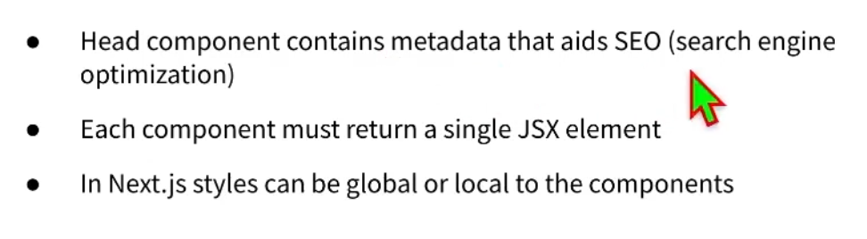
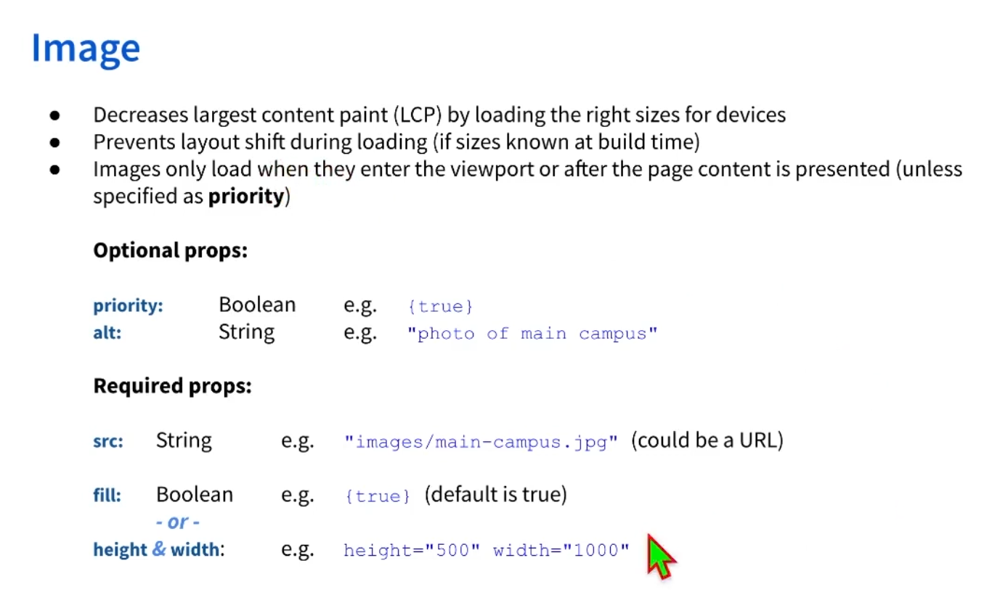
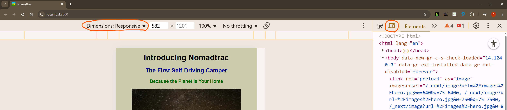
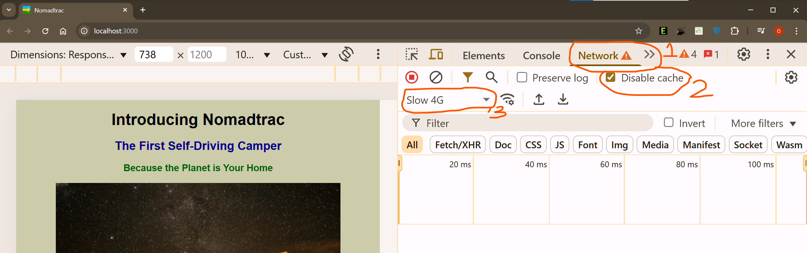
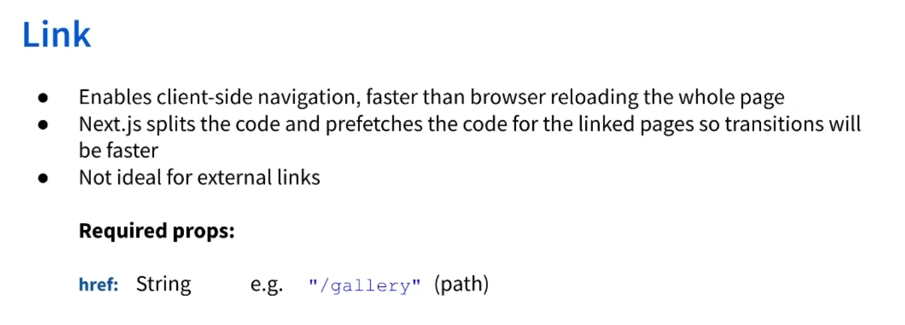
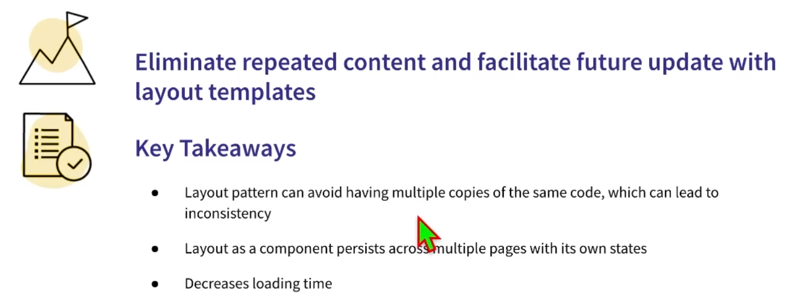

# Build a Multi-Page Portfolio Website using Next.js
The course is available at: https://www.coursera.org/learn/nextjs-for-beginners-multi-page-portfolio-website/.

The outome of the project is to create a multi-page website with optimized navigation using Next.js. 
```bash
npx create-next-app@latest
```

```bash
cd portfolio
npm run dev
```

This project uses the global components.

## Checking for compatibility

- A. Device Compatibility
There are ways we can check the responsiveness of the webpage. One of such ways is to test for device compatibility as shown in the image below:


- B. Network Compatibility
The below is particularly useful for network and to see how quickly images load.

DO this test for a:
    - slow 4G
    - 3G \
networks.

## Link Component


## Layout Component

This is made available in the components folder with the file `Layout.jsx`
In this file, we delete what is not common among the pages that we intend to have.
